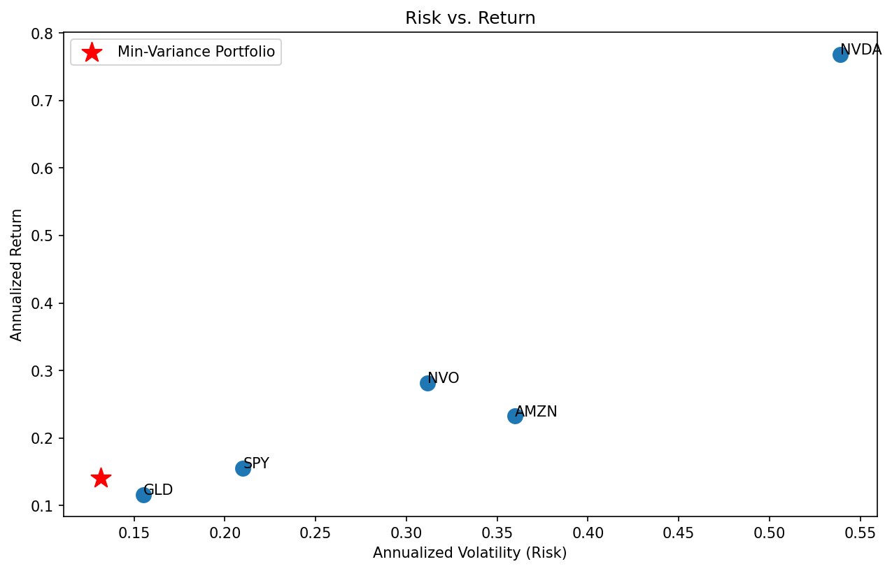
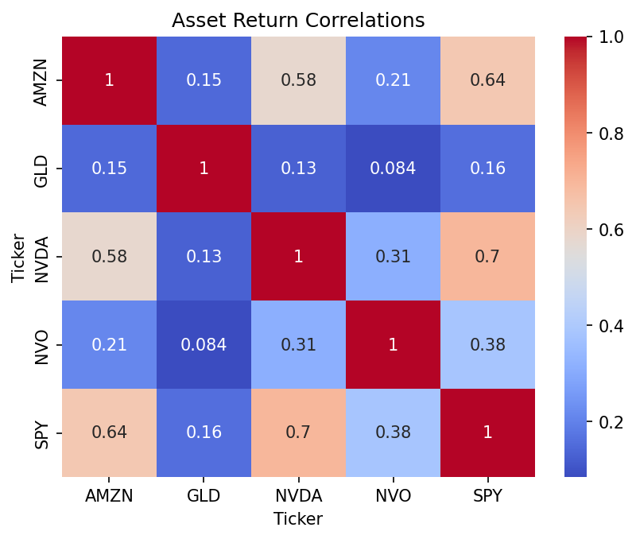

# Portfolio Risk & Return Analyzer

A Python analysis of the risk, return, and diversification characteristics of a
five-asset portfolio (AMZN, GLD, NVDA, NVO, SPY), culminating in a
minimum-variance portfolio constructed via constrained optimization.

## What it does

- Pulls 5 years of daily price data (2020–2024) via `yfinance`
- Computes daily and annualized returns and volatility for each asset
- Analyzes the correlation and covariance structure across assets
- Constructs the minimum-variance portfolio using `scipy.optimize` (SLSQP)
  with no-short-selling and full-investment constraints

## Key findings

- **Gold (GLD) was the primary diversifier.** It was nearly uncorrelated with
  the equities (0.08–0.16), while the tech names moved closely with the S&P 500
  (NVDA–SPY: 0.70), reflecting their weight as index constituents.
- **Diversification measurably reduced risk.** An equal-weight portfolio had
  23.0% annualized volatility, which was well below the 31.5% average of the individual
  assets. This is purely because the assets are imperfectly correlated.
- **The minimum-variance portfolio (≈65% GLD, 27% SPY, 8% NVO) reached 13.2%
  volatility, making it lower than any individual asset given, including gold.** This
  demonstrates the core result of diversification: a portfolio can be less risky
  than its least-risky component.

## Limitations & future work

Minimizing variance ignores return entirely. The optimizer excluded the two
highest-return assets (NVDA, AMZN) and produced a low-risk but low-return
(≈14%) portfolio. A more practical extension would optimize for risk-adjusted
return (maximum Sharpe ratio) or map the full efficient frontier, which balances
risk against expected return rather than minimizing risk alone.

## Tools

Python · pandas · NumPy · scipy.optimize · matplotlib · seaborn

## Running it

Open `Portfolio_Risk_and_Return_Analyzer.ipynb` in Jupyter and run all cells
top to bottom. Requires: `pandas`, `numpy`, `yfinance`, `scipy`, `matplotlib`,
`seaborn`.
